# F.A.D.E: Fully Agentic Drug Engine

> **Transform natural language into drug discovery pipelines using AI**

```
🧬 "Find KRAS inhibitors for cancer" → 💊 Novel drug candidates
```

---

## What is F.A.D.E?

F.A.D.E is an AI-powered drug discovery system that understands natural language and automatically runs computational drug discovery pipelines. Instead of manually setting up complex workflows, you simply describe what you want to discover.

### The Problem F.A.D.E Solves

**Traditional Drug Discovery:**
```
Scientist → Complex Setup → Multiple Tools → Manual Analysis → Results
    ↑              ↑              ↑              ↑
Time-consuming   Error-prone    Disconnected   Tedious
```

**F.A.D.E Drug Discovery:**
```
"Find EGFR inhibitors" → AI Understanding → Automated Pipeline → Drug Candidates
       ↑                        ↑                    ↑                 ↑
Simple English        Smart Parsing       HPC Execution      Ready Results
```

---

## System Architecture

### 🏗️ Three-Layer Architecture

```mermaid
graph TB
    A[👤 User Interface<br/>Natural Language Input] --> B[🌐 API Gateway<br/>Query Processing]
    B --> C[⚙️ Backend Pipeline<br/>Drug Discovery Agents]
    C --> D[🖥️ HPC Cluster<br/>Computational Resources]
    
    subgraph "Frontend Layer"
        A
    end
    
    subgraph "Gateway Layer" 
        B
    end
    
    subgraph "Backend Layer"
        C
    end
    
    subgraph "Compute Layer"
        D
    end
```



---

## Components Overview

### 🎨 Frontend (React/Next.js)

**What it does:** Beautiful web interface where users input drug discovery requests

**Key Features:**
- Natural language query input
- Real-time progress monitoring
- Interactive results visualization
- Chat-like interface for easy interaction

**Technology:**
- Next.js 14 with TypeScript
- Responsive design
- Real-time job status updates

**Example Interaction:**
```
User: "Find molecules that target KRAS G12D mutation"
      ↓
F.A.D.E: "🚀 Drug discovery pipeline started! Job ID: abc123..."
```

---

### 🌐 Gateway (FastAPI)

**What it does:** Smart API layer that processes requests and orchestrates pipeline execution

**Key Features:**
- **Query Classification:** Determines if user wants information or pipeline execution
- **Job Management:** Submits and monitors HPC jobs
- **Authentication:** Handles API keys and user sessions
- **Results Aggregation:** Compiles and formats pipeline outputs

**Technology:**
- FastAPI with async processing
- Background job queue management
- RESTful API endpoints

**API Endpoints:**
```
POST /jobs           → Submit drug discovery request
GET  /jobs/{id}      → Get job status
GET  /health         → Service health check
```

---

### ⚙️ Backend (Python Agents + Nextflow)

**What it does:** Computational pipeline that performs actual drug discovery

#### Current Components:

##### 🎯 RCSB Target Selector (Active)
**Purpose:** Find experimental protein structures for drug targets

**Process:**
1. **LLM Parsing:** Extract protein names and requirements from natural language
2. **RCSB Search:** Find experimental structures in Protein Data Bank
3. **Structure Ranking:** Select best structures based on resolution and drug discovery criteria
4. **Download:** Retrieve PDB structures and extract sequences

**Example:**
```
Input:  "Find KRAS inhibitors"
        ↓
Output: • KRAS protein structure (PDB: 6DUK)
        • Protein sequence (FASTA)
        • Drug requirements (JSON)
```

##### 🔬 Structure Processor (Active)
**Purpose:** Prepare protein structures for downstream analysis

**Process:**
1. **Validation:** Check structure quality and completeness
2. **Preparation:** Clean structures for docking simulations
3. **Analysis:** Generate structure quality reports

#### Future Components:

##### 💊 Molecule Generator (Planned)
- LLM-guided molecule design
- Chemical library generation
- Drug-like property filtering

##### 🧪 Docking Engine (Planned)
- Virtual screening simulations
- Binding affinity prediction
- Pose analysis and ranking

---

## How It Works

### 🔄 Complete Workflow

```
1. 👤 User Input
   "Design brain-penetrant EGFR inhibitors for glioblastoma"
   
2. 🧠 AI Parsing
   Target: EGFR
   Requirements: Brain-penetrant, Glioblastoma treatment
   
3. 🔍 Structure Discovery
   Search RCSB PDB → Find EGFR structures → Download best match
   
4. 💊 Drug Design (Future)
   Generate molecules → Filter for brain penetration → Optimize
   
5. 🧪 Virtual Screening (Future)
   Dock molecules → Predict binding → Rank candidates
   
6. 📊 Results
   Top drug candidates with analysis and recommendations
```

### 🎛️ Current Status

| Component | Status | Description |
|-----------|--------|-------------|
| 🎨 Frontend | ✅ **Active** | Web interface for queries and results |
| 🌐 Gateway | ✅ **Active** | API management and job orchestration |
| 🎯 Target Selector | ✅ **Active** | RCSB structure retrieval |
| 🔬 Structure Processor | ✅ **Active** | PDB structure preparation |
| 💊 Molecule Generator | 🔄 **Planned** | AI-driven molecule design |
| 🧪 Docking Engine | 🔄 **Planned** | Virtual screening pipeline |
| 📈 Lead Optimization | 🔄 **Planned** | Iterative improvement |

---

## Quick Start Guide

### 🚀 Setup & Installation

**1. Prerequisites:**
```bash
# Required software
- Python 3.9+
- Node.js 18+
- ngrok account
- Gemini API key
```

**2. Environment Setup:**
```bash
# Clone repository
git clone https://github.com/Naveen-R-M/F.A.D.E
cd F.A.D.E

# Backend setup
cd backend
pip install -r requirements.txt

# Frontend setup  
cd ../frontend
npm install
```

**3. Configuration:**
```bash
# Set API keys
export GEMINI_API_KEY="your_gemini_api_key"

# Configure ngrok
ngrok config add-authtoken your_ngrok_token
```

### 🏃 Running F.A.D.E

F.A.D.E offers two execution methods depending on your needs:

#### Method 1: Simple Pipeline Script (Recommended)

**Best for:** Quick testing, development, and straightforward execution

```bash
# 1. Start Backend Pipeline
cd backend
chmod +x pipeline.sh
./pipeline.sh "Find EGFR inhibitors for lung cancer"

# 2. Start Gateway Service
cd ../gateway
python -m app.main

# 3. Start Frontend
cd ../frontend
npm run dev

# 4. Expose Services (ngrok)
ngrok start --all --config ngrok.yml
```

**Advantages:**
- Simple shell script execution
- Easy debugging and monitoring
- Direct file output
- No workflow engine dependencies

#### Method 2: Nextflow Pipeline (Advanced)

**Best for:** Complex workflows, HPC clusters, and production deployments

```bash
# 1. Start Backend Pipeline (Nextflow)
cd backend/nextflow
nextflow run main.nf --query "Find EGFR inhibitors for lung cancer"

# 2. Start Gateway Service
cd ../../gateway
python -m app.main

# 3. Start Frontend
cd ../frontend
npm run dev

# 4. Expose Services (ngrok)
ngrok start --all --config ngrok.yml
```

**Advantages:**
- Professional workflow management
- Automatic job scheduling on HPC
- Built-in progress tracking
- Scalable execution
- Resume capability on failures

#### Execution Comparison

| Feature | Pipeline Script | Nextflow Pipeline |
|---------|----------------|-------------------|
| **Setup Complexity** | Low | Medium |
| **Debugging** | Easy | Advanced |
| **HPC Integration** | Manual | Automatic |
| **Scalability** | Limited | High |
| **Progress Tracking** | Basic | Advanced |
| **Resume on Failure** | Manual | Automatic |
| **Best for** | Development/Testing | Production/Research |

### 🔗 Access Your System

Once running, you'll have:
- **Frontend:** `https://random-url.ngrok.io` (user interface)
- **Gateway:** `https://different-url.ngrok.io` (API backend)

---

## Example Queries

### 💬 What You Can Ask F.A.D.E:

**Target Discovery:**
```
"What is KRAS and why is it important in cancer?"
"Find experimental structures for EGFR protein"
```

**Drug Discovery Requests:**
```
"Find EGFR inhibitors for lung cancer with oral bioavailability"
"Design KRAS G12C inhibitors with brain penetration"
"Discover molecules targeting PDB structure 6DUK"
```

**Advanced Requests:**
```
"Find BBB-permeable inhibitors for BRAF V600E mutation"
"Design selective CDK4/6 inhibitors avoiding cardiac toxicity"
```

### 📱 User Interface

The frontend provides:
- **Chat Interface:** Natural conversation with F.A.D.E
- **Quick Actions:** Pre-built queries for common requests
- **Progress Monitor:** Real-time pipeline status
- **Results Dashboard:** Interactive results exploration

---

## Project Architecture


## Technology Stack

### 🛠️ Core Technologies

| Layer | Technology | Purpose |
|-------|------------|---------|
| **Frontend** | Next.js + TypeScript | User interface and interaction |
| **Gateway** | FastAPI + Python | API management and orchestration |
| **Pipeline** | Python + Shell Scripts | Drug discovery computations |
| **Infrastructure** | ngrok + HPC | Deployment and scaling |

### 🧠 AI Integration

| Component | AI Model | Function |
|-----------|----------|----------|
| **Query Parsing** | Google Gemini | Extract targets and requirements |
| **Structure Selection** | Rule-based + LLM | Rank protein structures |
| **Molecule Generation** | Gemini + RDKit | Design drug candidates |
| **Results Analysis** | Gemini | Generate natural language reports |

### 🔬 Scientific Tools

| Tool | Purpose | Status |
|------|---------|--------|
| **RCSB PDB** | Protein structure database | ✅ Active |
| **BioPython** | Protein sequence processing | ✅ Active |
| **RDKit** | Chemical informatics | 🔄 Planned |
| **AutoDock Vina** | Molecular docking | 🔄 Planned |
| **PyMOL** | Structure visualization | 🔄 Planned |

---

## Project Structure

```
F.A.D.E/
├── 🎨 frontend/                 # React web application
│   ├── components/              # UI components
│   ├── app/                     # Next.js pages
│   └── .env.local              # Frontend configuration
│
├── 🌐 gateway/                  # FastAPI service
│   ├── app/                     # Gateway application
│   ├── agents/                  # LLM agents
│   └── .env                     # Gateway configuration
│
└── ⚙️ backend/                  # Drug discovery pipeline
    ├── agents/                  # Specialized agents
    │   ├── target_selector/     # RCSB target selection
    │   └── base/               # Base agent classes
    ├── utils/                   # Utility modules
    ├── rcsb/                    # RCSB PDB integration
    ├── data/                    # Input/output data
    └── pipeline.sh             # Main execution script
```

---

## Development Status

### ✅ What's Working Now

**Complete Drug Target Discovery:**
1. Natural language query processing
2. Experimental protein structure retrieval
3. Structure quality validation
4. Sequence extraction and analysis

**Example Output:**
```json
{
  "target": "EGFR",
  "pdb_id": "6DUK", 
  "resolution": "2.8 Å",
  "method": "X-ray crystallography",
  "confidence": 1.0
}
```

### 🔄 What's Coming Next

**Molecule Generation Pipeline:**
- AI-powered drug candidate design
- Chemical property prediction
- Drug-like molecule filtering

**Virtual Screening:**
- High-throughput docking simulations
- Binding affinity prediction
- Lead compound optimization

---

## Contributing

### 🤝 How to Get Involved

**For Researchers:**
- Submit feature requests for specific drug targets
- Provide feedback on pipeline outputs
- Suggest improvements to drug discovery workflow

**For Developers:**
- Add new molecular property predictors
- Implement additional docking algorithms
- Enhance LLM integration capabilities

### 📧 Contact

- **Authors:**
    - [Naveen Rajagopal Mohanraj](mailto:rajagopalmohanraj.n@northeastern.edu)
    - [Jason Kantorow](mailto:kantorow.j@northeastern.edu)
    - [Natesan Mani](mailto:mani.na@northeastern.edu)
    - [Sherry Zong](mailto:xzong30@gatech.edu)
- **GitHub:** [F.A.D.E Repository](https://github.com/Naveen-R-M/F.A.D.E)
- **Issues:** Use GitHub Issues for bug reports and feature requests

---

## License & Disclaimer

**Educational Use:** This project is for research and educational purposes.

**Drug Discovery Disclaimer:** F.A.D.E provides computational predictions only. All results require experimental validation before any therapeutic applications.

**AI Disclaimer:** While F.A.D.E uses advanced AI models, human expert review is essential for all drug discovery decisions.

---

*Built with ❤️ for the future of AI-powered drug discovery*
